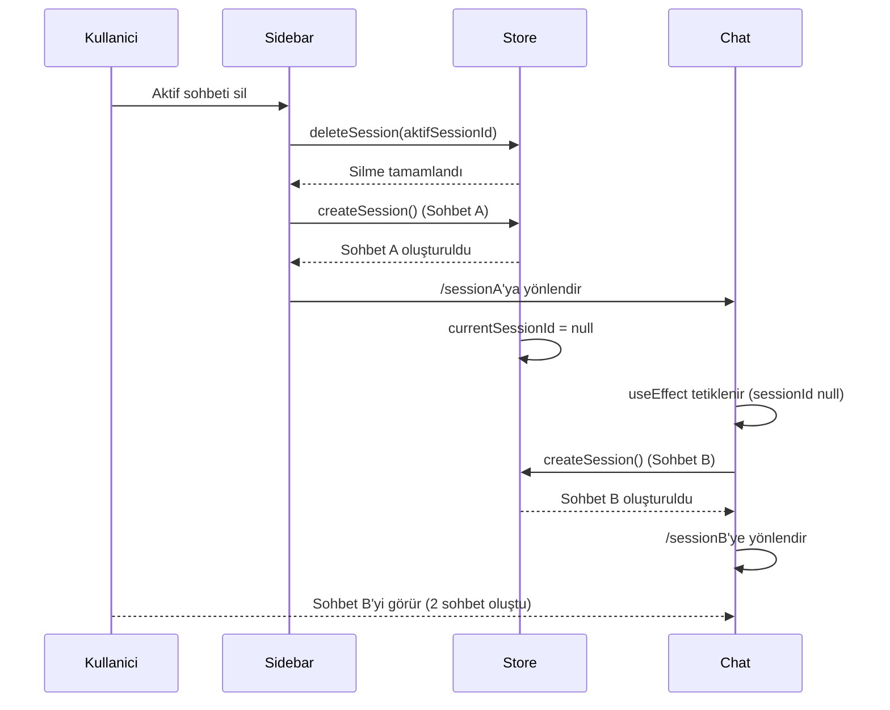
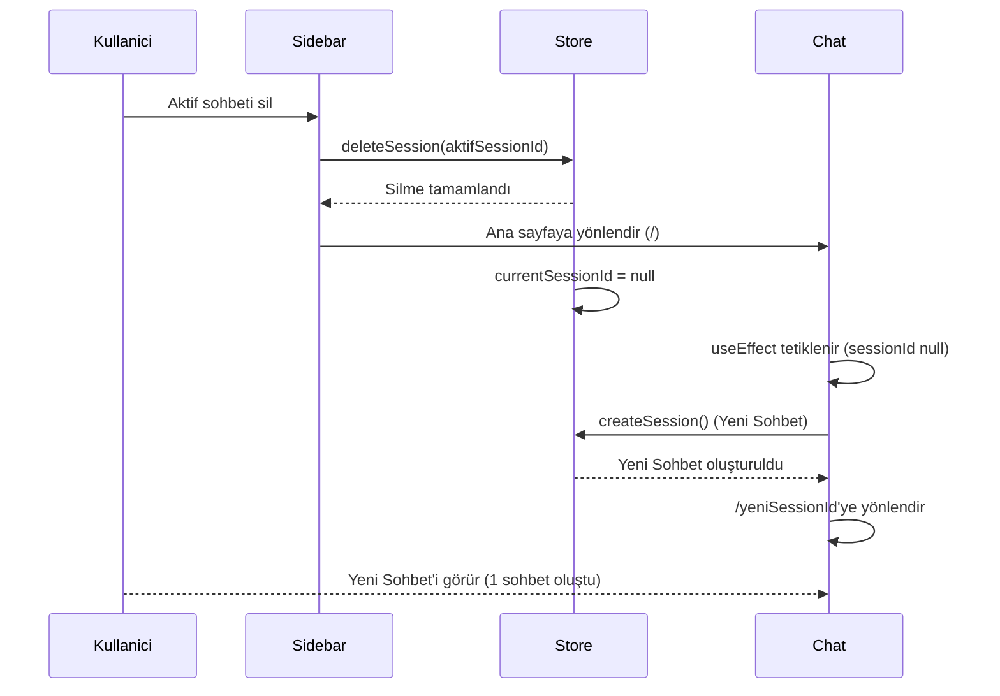

# Sohbet Silme Akış Diyagramı

## Mevcut Sorunlu Akış

## Düzeltilmiş Akış

## Açıklama

1. **Mevcut Sorun**: Sidebar ve Chat bileşeni aynı anda yeni sohbet oluşturuyordu.
2. **Çözüm**: Sadece Chat bileşeninin yeni sohbet oluşturmasına izin veriyoruz.
3. **Değişiklik**: Sidebar'da `handleDeleteSession` fonksiyonundaki yeni sohbet oluşturma kısmını kaldırdık ve sadece ana sayfaya yönlendirme yapıyoruz.
    id["This ❤ Unicode"]